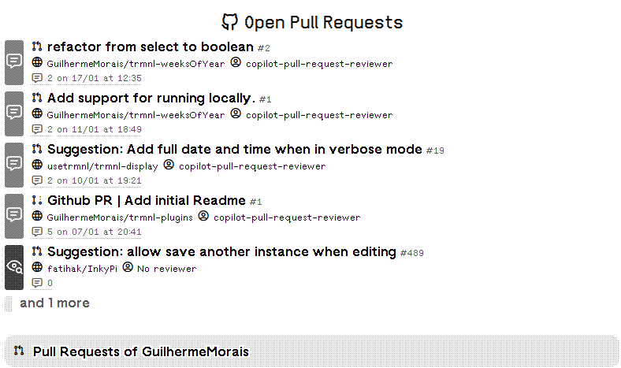
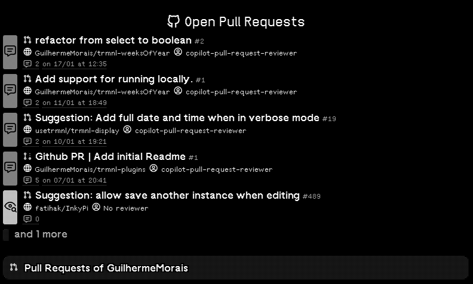

# GitHub Pull Request Viewer

A lightweight plugin that surfaces your open GitHub pull requests, making it easy to monitor progress without leaving your workflow.
TRMNL extension to show open Pull Request on GitHub.

## Screenshots





## Install

You can go to the following link to install this recipe: https://usetrmnl.com/recipes/221833/install
Or you can copy the files from the `src` folder zip it and add it manually.

## Views

| View            | File                     | Description                               |
| --------------- | ------------------------ | ----------------------------------------- |
| Full            | `full.liquid`            | Full screen display                       |
| Half Horizontal | `half_horizontal.liquid` | Half screen, landscape                    |
| Half Vertical   | `half_vertical.liquid`   | Half screen, portrait                     |
| Quadrant        | `quadrant.liquid`        | Quarter screen                            |
| Shared          | `shared.liquid`          | Contains shared variables for all screens |

## Local Development

First, start the docker development server:

```bash
docker-compose up -d
```

Then, you can edit the files in the `src` folder and see the changes reflected in your browser: http://localhost:8001

## License

